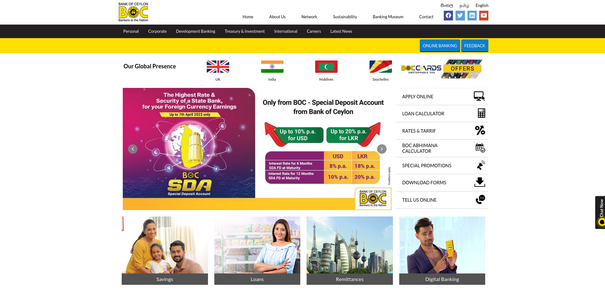
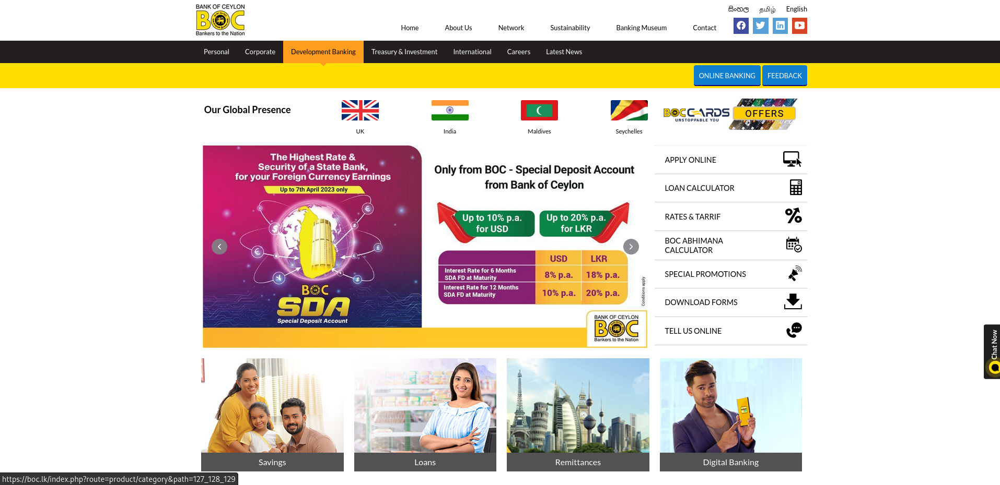
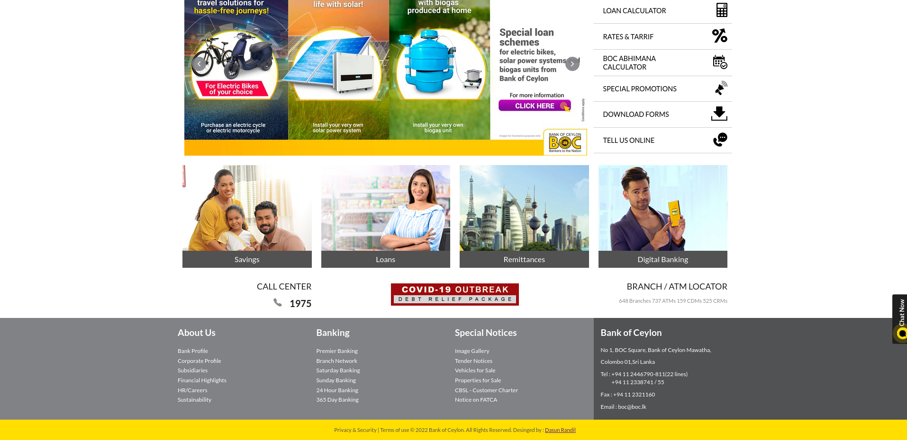

# <b>Project Details</b>

This is a project carried out by me to check the boundaries and limitations when it comes to designing front ends. This is a clone of the Bank of Ceylon(BOC) Sri Lanka. This project which is a clone of the BOC official website has been developed only for educational purposes. All credits of the design and resources goes to it's original creators.

## <b>Built Using</b>

* [HTML5](https://www.w3schools.com/html/default.asp) 
* [CSS](https://www.w3.org/Style/CSS/Overview.en.html)

## <b>Contact</b>

Dasun Randil : [@LinkedIn](https://www.linkedin.com/in/dasun-randil-5a342123a)  

## <b>More Details</b>

Clone the website using : https://github.com/dasunrandil/boc-clone

Link to the cloned website : https://dasunrandil.github.io/boc-clone/

